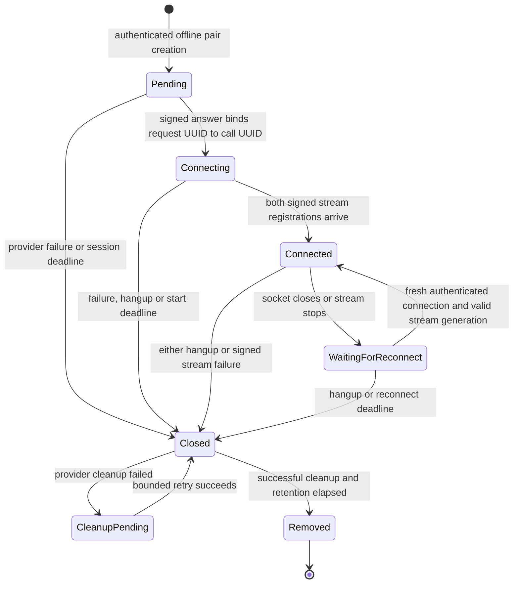

# Phase 2 — independent Plivo call legs

Date: 9 October 2026. Branch: `feature/realtime-stt-language-router`.

**PASS — offline implementation and verification. BLOCKED — live calling, real media-isolation evidence, and production activation.**

## Requirement results

| Requirement | Status | Evidence / limit |
| --- | --- | --- |
| Reuse the existing independent modules | PASS | Existing manager, engine, callback controller, signed callback controller, creator, URL/XML builders and route registrar are reused. No framework or dependency was added. |
| One internal session with two independent provider requests/calls | PASS | Orchestrator creates a customer/staff pair; request UUIDs and eventual call UUIDs are stored separately. |
| Answer, stream start/stop, failure and hangup lifecycle | PASS | Signed answers return media XML; signed stream events update ownership; either leg's hangup or stream failure closes the pair and schedules both-leg cleanup. |
| Initial and subsequent authenticated ownership | PASS | Verified SDK signatures, expected request UUID, fixed session/role, immutable call binding, signed stream status, per-leg connection capability, socket identity and stream-generation checks. |
| Duplicate callback / replay protection | PASS | Exact successful HTTP retries return cached responses; altered, in-flight, failed-processing or WebSocket nonce reuse is rejected. Semantic duplicate answers/starts are idempotent. |
| Disabled-by-default route integration | PASS | No independent feature routes are registered unless `NUNES_INDEPENDENT_CALLS_ENABLED=true`; the pre-existing independent diagnostic route is also gated. |
| Authenticated creation and separate live approval gate | PASS | Bearer admin authentication plus explicit offline test mode is required. Live operations have a separate locked code approval gate and are refused by the Phase 2 orchestration/route policy. |
| Separate stream IDs / WebSocket owners / media pipelines | PASS | One active socket per session/role; a socket object cannot be reassigned; media requires matching call, signed stream registration, inbound track, codec and sequence. |
| Disconnect, reconnect, stale socket and cleanup handling | PASS | Closing sockets are released; replacement connections need fresh signatures/nonces; old disconnects cannot remove replacement sockets. Closed sessions and replay entries expire after successful cleanup. |
| Bounded state and orphan cleanup | PASS | Session/nonce/generation limits, start/reconnect/session deadlines, bounded provider diagnostics, cleanup retries and explicit failed-cleanup retention. |
| Preserve legacy call/dashboard/database behavior | PASS | Existing direct-bridge XML matches the tracked baseline. No dashboard, schema or database query was changed during Phase 2. |
| No audio forwarding or translated playback | PASS | Independent media is counted and discarded. No STT, translation, TTS, playback send or cross-leg audio queue is connected to this feature. Forwarding/activation methods throw. |
| Actual Plivo audio isolation / live production readiness | BLOCKED | No real call or provider media experiment was authorized or performed. |

## Architecture implemented

The server integrates `registerIndependentCallFeature` with the same independent manager used by the existing diagnostic route. Disabled mode returns before validating configuration, constructing an orchestrator, registering routes or starting a cleanup interval.

Enabled mode exposes authenticated internal create/status/cancel routes and signed Plivo answer, stream status, completion and independent WebSocket routes. `NUNES_INDEPENDENT_CALLS_TEST_MODE=true` is additionally required for creation, which uses the explicit offline provider by default and clearly reports `providerMode: "offline"`. Merely setting the feature flag does not start any call. Existing production credentials and `.env` were not edited; `.env.example` documents both flags as false.

The orchestrator creates a session before provider creation, stores each outbound-create request UUID, and binds the eventual call UUID only through an authenticated answer or unanswered-hangup callback carrying the matching request UUID. It does not derive a call UUID from a request UUID. Plivo documents these as separate callback fields. The live adapter uses the installed SDK's `calls.hangup(callUuid)` for known calls and `calls.cancel(requestUuid)` for pending requests, but both remain locked and were not invoked. [Plivo call contracts](https://www.plivo.com/docs/voice/api/calls)

Answers return only a blocking, inbound-track, 8 kHz mu-law `<Stream>` on `/plivo/independent/stream`, followed by `<Hangup/>`. The XML contains a signed status callback URL and a different random connection capability for each leg. It contains no `<Dial>`, conference, chatbot speech or playback instructions. The original `/plivo/inbound` direct bridge remains separate.

Each independent WebSocket must pass actual installed-SDK V3 validation against the configured external HTTPS origin, provide the server-issued capability, and refer to an already-bound answered leg. A WebSocket `start` message must match the expected call and authenticated `StreamID` from the HTTP status callback. If start arrives first, the socket waits for that callback and discards media; it does not establish ownership or buffer audio from self-reported IDs.

Plivo's current guide documents signed WebSocket upgrades, `CallUUID` / `StreamID` status fields, and `started`, `stopped`, `failed` events. Its troubleshooting material also uses `StartStream`, `StopStream`, `DroppedStream`; the dispatcher explicitly recognizes those aliases and rejects unknown events. [Streaming guide](https://www.plivo.com/docs/voice-agents/audio-streaming/concepts/audio-streaming-guide), [troubleshooting](https://www.plivo.com/docs/voice-agents/audio-streaming/troubleshooting/troubleshooting)

## Call lifecycle diagram

`Connected` is the manager's signed-stream-registration state. Each leg separately reports `socketConnected`; counters only advance when both its WebSocket start and its signed HTTP stream registration agree. Translation and isolation evidence remain false in every state. A replacement stream must have a new authenticated stream ID after an intentional stop; retired IDs cannot restart. A network reconnect can reuse the still-active stream ID with a new socket and fresh upgrade nonce.

## Existing files modified

- `.env.example`: disabled feature and offline test-mode flags only.
- `apps/realtime-server/src/index.ts`: integrates the feature registrar and gates the existing independent diagnostic route. Phase 1 edits remain intact; legacy routes and the false translation gate are preserved.
- `apps/realtime-server/src/independentCallSessionEngine.ts`: safe removal of closed sessions.
- `apps/realtime-server/src/independentLiveCallManager.ts`: bounded records, global request ownership, immutable expected requests, explicit close/removal and snapshots for cleanup.
- `apps/realtime-server/src/independentCallLegUrls.ts`: unified signed stream-status callback URL.
- `apps/realtime-server/src/independentCallLegXml.ts`: dedicated socket path, per-leg capability, status callback configuration and terminal hangup XML.
- `apps/realtime-server/src/independentPlivoCallCreator.ts`: separate locked live approval gate; future calls have explicit ring/time limits.
- `apps/realtime-server/src/independentCallRoutes.ts`: actual stream-event dispatch, answer XML integration, replay handling and lifecycle cleanup.
- `apps/realtime-server/src/signedIndependentCallCallbacks.ts`: matching request UUID required for initial answer/completion, bound call checks for streams, unanswered failure and idempotent terminal completion.
- `apps/realtime-server/src/plivoCallbackSecurity.test.ts`: all nine Phase 1 regressions retained; fixtures now include expected request UUIDs and fresh per-request nonces under the stricter contract.

The existing callback controller is reused unchanged. Existing user edits and untracked files were preserved. The generated dashboard TypeScript build-info change was restored after validation.

## New files added

- `apps/realtime-server/src/independentCallOrchestrator.ts`
- `apps/realtime-server/src/independentCallProvider.ts`
- `apps/realtime-server/src/independentCallFeature.ts`
- `apps/realtime-server/src/independentCallbackReplay.ts`
- `apps/realtime-server/src/independentCallIntegration.test.ts`
- `apps/realtime-server/src/independentCallbackReplay.test.ts`
- `apps/realtime-server/src/testSupport/plivoOfflineSignature.ts`
- `PHASE2_REPORT.md`

## Authentication, replay and fail-closed limits

- HTTP callback signatures are verified before mutation/replay caching. GET query fields are signed once through the full URL; POST sends only its form fields as SDK parameters. Duplicate query/form values and query/body collisions are rejected. Host and forwarded headers are not ownership evidence.
- Initial call identity must match the expected provider request UUID, and request ownership is unique across sessions and roles. `ALegRequestUUID` is accepted as a documented compatibility source; conflicting request fields are rejected. A callback received before its create result is recorded fails closed and cannot bind a call.
- Successful HTTP retries with the same nonce and canonical request return the cached response without repeating mutations or provider cleanup. Query ordering is normalized in the replay identity. A changed request, a processing failure, an in-flight duplicate or a reused upgrade nonce is rejected. A fresh nonce does not permit immutable call replacement or resurrection of a retired stream.
- Replay records are not time-evicted while the session exists. Limits are 1,000 retained sessions, 8,192 nonce entries per feature instance, and 256 retired stream generations per session. Capacity exhaustion fails closed; old live nonce records are not evicted to admit new ones.
- A closed session is normally removed after 60 seconds only after cleanup succeeded and creation is no longer in flight. Removing it also removes manager request ownership and its replay entries; later callbacks fail because the session no longer exists. After restart, unknown old sessions also fail closed.
- Defaults: 10-second socket-start/status deadline, 30-second reconnect grace, 30-minute maximum session age. The server runs one unreferenced cleanup sweep every second and closes both legs/sockets during shutdown. Cleanup failures are visible as `cleanupPending`, subject to at most five total automatic cleanup attempts, and retained within the session capacity bound for operator recovery rather than silently forgotten.
- Media payloads are never queued or forwarded. Separate per-leg counters retain no original audio. Duplicate/out-of-order accepted media sequences close the offending socket; duplicate started callbacks do not reset sequence protection.

## Audio isolation assessment

**PASS — supported architectural intent and offline no-forwarding behavior. BLOCKED — actual audio-isolation evidence.**

Plivo supports blocking bidirectional streams and restricts their streamed track to inbound audio. Two independently created calls using only those XML streams have no server-configured direct bridge or conference. This is the intended supported topology; it is not a proof of the actual audio path on the provider. [Plivo Stream XML capabilities](https://www.plivo.com/docs/voice/xml/audio-streaming)

The exact evidence blocker is the absence of approved real customer/staff calls with directional audio injection/capture. We have not verified provider-side cross-audio absence, playback targeting, codec behavior, or disconnect/reconnect XML timing. The final `<Hangup/>` intentionally terminates a leg after its stream finishes; the server's reconnect handling cannot promise that Plivo will keep a real leg alive after XML advances. That provider behavior must be measured.

If keeping an independent stream alive through reconnection requires provider control, use the documented independent call/stream control APIs to restart that same isolated leg after signed ownership validation, without adding a direct `<Dial>` or conference bridge. No unsupported muting assumption or isolation claim was used. `audioIsolationVerified=false` and translated playback remain locked.

## Test counts and results

**PASS — all workspace TypeScript checks and offline tests.**

Commands executed directly with the Windows `npm.cmd` shim:

- `npm.cmd run typecheck`: all workspace checks passed.
- `npm.cmd test`: **263 tests passed in 37 test files**.
- `git diff --check`: passed (only Git's normal LF/CRLF conversion notices).

Breakdown: realtime server **233 tests / 35 files**; language router **26 / 1**; translation/entity protection **4 / 1**. Phase 1's 229 tests remain, with **34 additional tests**: 27 Fastify/provider/WebSocket integration cases and 7 replay/lifecycle cases. Tests use actual V3 SDK verification, independently signed synthetic callbacks and in-memory Fastify WebSocket upgrades. No external Plivo/Sarvam/database service is contacted.

Coverage includes pair creation; distinct request/call UUIDs; both answers and streams; customer/staff hangup; failed creation and unanswered hangup; failure before stream start; duplicate delivery; forged callbacks; request mismatch; cross-session/cross-role claims; nonce/canonical-query replay; duplicate parameter rejection; cross-session stream IDs; unknown events; signed status/start races; invalid-token/unsigned/duplicate upgrades; repeated media sequences; network closing/reconnect; stale disconnect and stream generations; orphan deadlines; late create cancellation; cleanup failure/retry; capacity overflow; missing/default-disabled feature flag; unavailable/unauthorized admin access; explicit offline mode; direct live call/teardown rejection; legacy route coexistence; and blocked audio forwarding/translation.

## Remaining production blockers

1. **BLOCKED — live approval and adapter activation:** all live API paths are intentionally locked. The approved live wiring must be separately reviewed; setting environment flags cannot unlock it.
2. **BLOCKED — provider contract observation:** capture actual create responses, answer/hangup fields, event variants, early callback ordering, upgrade signature URI, proxy behavior and nonce handling. Current early/unknown callbacks and reused upgrade nonces fail closed; whether a provider retry uses a fresh nonce is not proven.
3. **BLOCKED — physical media isolation:** verify no original audio crosses legs and that playback reaches only the intended leg. Provider XML completion and auto-reconnect behavior require live measurement.
4. **BLOCKED — durable production lifecycle:** current ownership/replay records are single-process, bounded memory. Unknown sessions fail closed after restart or on another worker. Durable ownership, replay records, provider reconciliation and cleanup recovery are needed before multi-instance or restart-safe live operation.
5. **BLOCKED — cleanup failure operations:** permanent provider teardown failures retain a closed record and can eventually exhaust capacity. Production needs durable retries, observability and an operator recovery path; no failed cleanup is reported as successful.
6. **BLOCKED — translation and bypass:** there are intentionally no independent STT/translation/TTS providers or cross-leg sends. Hindi/Hinglish-to-Tamil, Tamil/Tanglish-to-Hindi, entity fidelity, Tamil original-audio bypass, latency, interruption and echo behavior remain Phase 3 work.
7. **BLOCKED — live dashboard/database validation:** existing integrations are untouched. Independent runtime state has not been persisted into the dashboard/database or tested against a real database.

No real Plivo calls, billable Sarvam requests, production deployment, credential changes, Git commit or push were performed. Production readiness is not claimed.

## Exact Phase 3 implementation plan

1. Define the durable independent lifecycle using the existing database integration: request/call/stream generations, terminal states, idempotent events, nonce records and provider cleanup jobs. Add restart, worker ownership, transaction/race and failed-cleanup recovery tests against isolated database fixtures.
2. Add an explicitly approved live adapter-selection path around the existing creator/SDK teardown adapter; verify supported pending-request cancellation, known-call hangup, create timeouts and late-result reconciliation with mocks. Preserve all Phase 2 gates until a concrete live test configuration is approved.
3. Validate actual Plivo contracts in approved controlled calls: create/answer/hangup UUID correlation, signature reconstruction behind the public proxy, actual status events, callback arrival ordering, retry nonce behavior, codec/tracks and auto-reconnect versus XML hangup timing. Update only confirmed contract differences, keeping failure paths closed.
4. Run a directional isolation experiment on two isolated legs. Inject distinguishable customer/staff audio and capture each endpoint independently. Confirm no direct original-audio path; test targeting separately on each leg; verify teardown/reconnect and complete the existing isolation-evidence contract. Do not enable translation to infer isolation.
5. Add separate mocked Sarvam receive pipelines per leg, reusing the existing language router and entity protection. Implement Hindi/Hinglish-to-Tamil and Tamil/Tanglish-to-Hindi transformation, codec/sample-rate conversion where necessary, integrity checks, provider deadlines and cancellation. No playback is enabled while isolation is unverified.
6. Implement controlled opposite-leg playback and Tamil-to-Tamil original-audio forwarding under the verified-isolation gate. Add offline tests for exclusive routing, no dual original/translated path, barge-in, echo suppression, stale generations, queued-audio cancellation and disconnect cleanup.
7. Persist truthful independent lifecycle/language/translation events and expose them through the existing authenticated dashboard. Verify the complete flow using offline providers and database fixtures before any billable translation experiment.
8. After explicit approval for billable Sarvam and real telephony acceptance tests, validate both translation directions, Tamil bypass, technical entities, latency, interruptions and full cleanup. Only after these and actual isolation tests pass, prepare a separate activation/deployment change for explicit approval. Never activate translated playback on the preserved legacy direct bridge.

## Approval required before real Plivo calls

**BLOCKED pending a separate explicit user instruction approving real billable calls.** Approval must identify the controlled test scope: customer/staff numbers, caller ID, call/time/budget limits, provider account/environment and teardown plan. An approved configuration/code review is then required to unlock live provider wiring. No approval is requested or inferred from this Phase 2 task; all requested offline work is complete.
